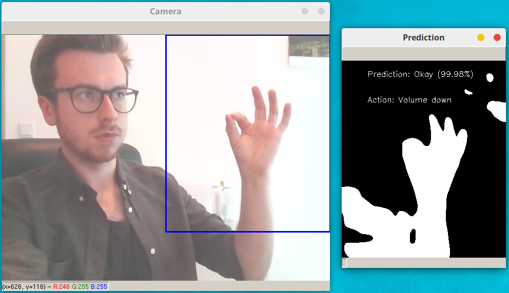

# hand-gestures-recognition 
## volume controller :wave: :arrow_right: :speaker: :sound: :mute:
Autor: Mateusz Plinta
Opis: Projekt realizowany w ramach zajęć Śledzenie Ruchu (Motion Tracking)
Uczelnia: AGH im. Stanisława Staszica w Krakowie
# Dokumentacja
Program wykorzystuje dwa rodzaje śledzenia ruchu: detekcja dłoni oraz rozpoznawanie gestów rąk.
Ideą projektu był program umożliwiający sterowanie dowolną, możliwą do skonfigurowania rzeczą przy pomocy gestów dłoni. Przykładowo, w tym programie zaimplementowano sterowanie głośnością dźwięku systemu przy pomocy (głównie) 3 gestów dłoni. 
## Opis
Program wykorzystuje bibliotekę **opencv**, **tensorflow** oraz **keras** do załadowania odpowiednich modeli i przewidywania gestów.
Po uruchomieniu, jesteśmy poproszeni o wybranie obrazu, będącego tłem dla badanej ręki, co robimy przyciskając klawisz `b`. Jest to potrzebne do późniejszego prawidłowego usunięcia tła i pozostawienia samej dłoni, w widoku po odpowiednim przetworzeniu obrazu, gdzie widokiem końcowym jest dwukolorowa grafika. 
Po załadowaniu obrazu tła następuje ciągłe wykrywanie dłoni na wyznaczonym obszarze. Jeżeli program wykryje obecność dłoni (w dowolnym geście), następuje rozpoznawanie gestu dłoni (predykcja), oraz na podstawie uzyskanego wyniku, oraz jego dokładności, jest wykonywana konkretna akcja. Wykorzystywany model w teorii pozwala na rozróżnienie 5 różnych gestów, jednak w praktyce wykorzystano poniższe trzy, z racji na ich największą dokładność:
* :point_up_2: - wyłączenie wyciszenia i pogłaśnianie :sound:
* :ok_hand: - wyłączenie wyciszenia i ściszanie :speaker:
* :fist: - wyciszanie :mute:

Uprzednie wykrywanie obecności dłoni zostało zastosowane, aby przyspieszyć program, z racji na to że metoda wykrywająca gesty dłoni zajmuje stosunkowo dużo czasu, co niekorzystnie wpływa na prędkość reakcji programu. Dodatkowo, w celu przyspiedzenia działania programu wykorzystano wielowątkowość: opisane akcje wykrywania dłoni oraz analiza konkretnych gestów jest wykonywana przez poboczne procesy, tzw. workery. Proces główny natomiast zajmuje się tylko wyświetlaniem obrazu oraz obsłużeniem kontrolera dźwięku w zależności od predykcji zwróconej przez workera.
## Prezentacja
#### Up(L) :point_up_2: - pogłaśnianie 

#### Ok :ok_hand: - ściszanie 

#### Fist :fist: - wyciszanie 

### Preview [[link do wideo]](https://youtu.be/Wsoi_Ua9gs0)

## Użyte metody, biblioteki...
Zbieranie klatek wideo zostało zaimplementowane na dwa sposoby. Pierwszy `cv2.VideoCapture(0)`, gdy program jeszcze wykonuje się sekwencyjnie, oraz drugi `WebcamVideoStream(src=0, width=640, height=480).start()`, który implementuje wbudowaną równoległość. Klatki pozyskane z tej metody pakowane są do kolejki ([Queue](https://docs.python.org/3/library/queue.html)), która automatycznie rozsyła klatki do odpowiednich workerów. Oni zaś zwracają przy pomocy innej kolejki informacje o predykcji i jej wyniku procentowym.

Klatki w formie czarno-białej są uzyskiwane poprzez następujące operacje:
1. Usunięcie tła:
    ```python
    fgmask = bgModel.apply(frame, learningRate=learningRate)
    kernel = np.ones((3, 3), np.uint8)
    fgmask = cv2.erode(fgmask, kernel, iterations=1)
    res = cv2.bitwise_and(frame, frame, mask=fgmask)```
2. Obcięcie obrazu:
    ```python
    img = img[0:int(cap_region_y_end * frame2.shape[0]), int(cap_region_x_begin * frame2.shape[1]):frame2.shape[1]]
    ```
3. Konwersja na skalę szarości oraz zastosowanie rozmycia gaussowskiego:
    ```python
    gray = cv2.cvtColor(img, cv2.COLOR_BGR2GRAY)
    blur = cv2.GaussianBlur(gray, (blurValue, blurValue), 0)
    ```
4. Obróbka przez poziom progowy `cv2.threshold()`
    ```python
    ret, thresh = cv2.threshold(blur, threshold, 255, cv2.THRESH_BINARY + cv2.THRESH_OTSU)
    ```

Inicjalizacja sesji tensorflow oraz wykrywanie dłoni:
```python
detection_graph, sess = detector_utils.load_inference_graph()
sess = tf.Session(graph=detection_graph)
boxes, scores = detector_utils.detect_objects(frame, detection_graph, sess)
```

Ładowanie pobranego modelu gestów dłoni oraz predykcja, wykorzystując metodę `load_model` z biblioteki keras:
```python
model = load_model('models/VGG_cross_validated.h5')

def predict_rgb_image_vgg(image, model):
    image = np.array(image, dtype='float32')
    image /= 255
    pred_array = model.predict(image)
    result = gesture_names[np.argmax(pred_array)]
    score = float("%0.2f" % (max(pred_array[0]) * 100))
    return result, score
```
